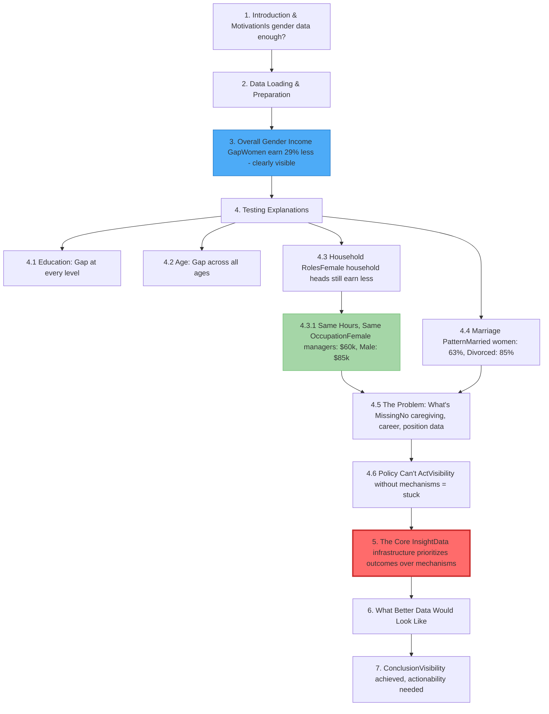

# Gender Income Inequality in the ACS Dataset: When Good Data Isn't Enough

## Overview & Motivation

Inspired by Caroline Criado Perez's *Invisible Women*, this analysis examines the 2018 American Community Survey (ACS) income data to explore a critical question: 

**Is collecting gender-disaggregated data sufficient for addressing inequality?**

While the ACS exemplifies responsible data practices (gender-inclusive, well-documented, balanced representation), it reveals persistent income disparities (women earn 29% less) without capturing the mechanisms driving them. 

**Key findings:**
- Women earn 29% less than men (median)
- Gap persists across education, occupation, age, household roles
- Female managers earn 29% less than male managers in same occupation
- Both sexes work 40 hours median, yet gaps remain
- Married women face largest penalty (37% gap)

**The thesis:** Current data infrastructure prioritizes documenting *who* is disadvantaged over explaining *why* and *how*. Without mechanism data—caregiving responsibilities, career patterns, within-occupation positions—policy operates with clear evidence of inequality but no clear path to intervention.

**The result:** Perfect visibility, limited actionability.

This project demonstrates that good data makes problems visible, but better data makes them actionable.


## Analysis Structure

## Key Findings

### What the Data Shows 
- Women earn 29% less than men (median income gap)
- Gap persists across all education levels
- Female managers earn 29% less than male managers in same occupation code
- Both sexes work 40 hours/week median, yet gaps remain
- Married women earn only 63% of married men's income
- Disparities compound intersectionally for women of color

### What the Data Cannot Show 
- **Why** the gaps exist (caregiving? discrimination? career interruptions?)
- **How** to design targeted interventions
- **Which** mechanisms drive different portions of the gap
- **Whether** policy interventions would work

### The Core Insight
> "Good data makes problems visible. Better data makes problems actionable."

The ACS successfully documents inequality but lacks the mechanism variables needed to make it addressable through policy.

---

## Project Structure


---

## For Reviewers

**Quick Read (15 min):** 
- Read Overview
- Jump to notebook Sections 4.6-5 (core argument)
- Read Section 7 (conclusion)

**Full Analysis (45 min):**
- Follow the complete notebook from Section 1-7
- See flowchart above for navigation

**Core Contribution:**
Sections 4.6-5 contain the main thesis about data infrastructure limitations.

## Dataset
- **Source**: American Community Survey (2018) via fairlearn library
- **Sample Size**: 1,664,500 observations across 50 US states
- **Key Variables**: 
  - Demographics: Sex, Race, Age
  - Socioeconomic: Education (SCHL), Occupation (OCCP), Income (PINCP)
  - Household: Relationship to householder (RELP), Marital status (MAR)
  - Work: Hours worked per week (WKHP)
- **Data Quality**: Well-documented, balanced gender representation (~50/50)


## Tools & Libraries
- Python 3.11
- pandas
- fairlearn
- matplotlib/seaborn
- scipy/statsmodels [if using statistical tests]


## How to Run
```bash
pip install fairlearn pandas matplotlib seaborn
jupyter notebook bias_analysis.ipynb
```

## References

**Core inspiration:**
- Criado Perez, C. (2019). *Invisible Women: Data Bias in a World Designed for Men*. Abrams Press.

**Data source:**
- U.S. Census Bureau. (2018). American Community Survey. Retrieved via fairlearn library.
- Fairlearn documentation: https://fairlearn.org/


## Author
Harshatha Prasanna
https://github.com/harshatha-prasanna


